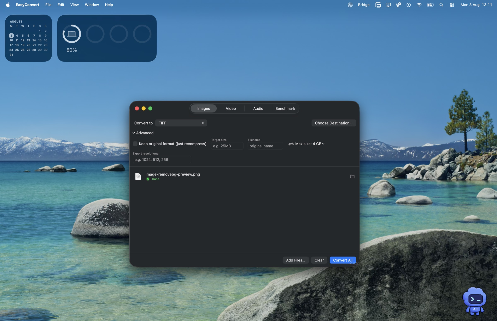
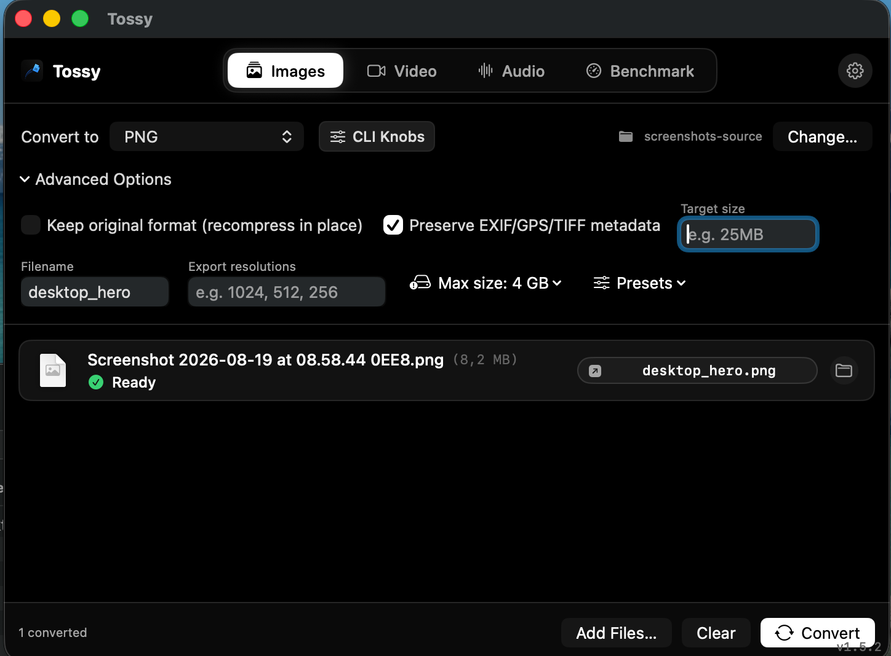
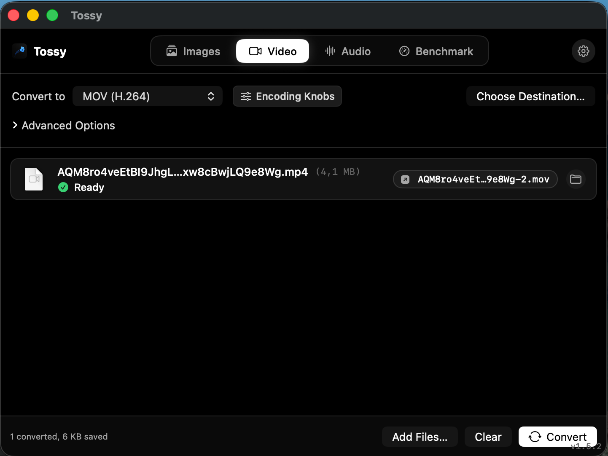

# Tossy

[](https://github.com/thatonemacosdev/tossy-macos/releases/tag/v1.7.1)
[](LICENSE)
[](https://github.com/thatonemacosdev/tossy-macos/releases)

> Toss your files in. Toss them out in whatever format you need.

A free, native macOS utility for converting images, video, and audio without Terminal, without uploading files anywhere, and without installing Homebrew or ffmpeg yourself. Toss files in, pick a format, convert. Handles everyday formats like HEIC, MP4, and MP3 as well as RAW camera files, MKV, WebM, FLAC, animated GIFs, animated WebP, and dozens more.

Website: [thatonemacosdev.github.io/tossy-macos](https://thatonemacosdev.github.io/tossy-macos/)  
Download: [v1.7.1 release](https://github.com/thatonemacosdev/tossy-macos/releases/tag/v1.7.1)

### Opening on macOS (Gatekeeper Notice)

Because Tossy is an open-source tool distributed directly on GitHub without an Apple Developer ID subscription:
- **First Launch**: **Right-click** (or **Control-click**) `Tossy.app` in `/Applications` and select **Open**, then click **Open** in the dialog. macOS will remember this exception permanently.
- **Alternative**: Go to **System Settings > Privacy & Security** > scroll to **Security** > click **"Open Anyway"**.
- **Terminal One-Liner**: Run `xattr -cr /Applications/Tossy.app`.

Under the hood: GPU-accelerated image processing (Metal via Core Image) and hardware video encoding (VideoToolbox via AVFoundation) where the platform supports it, falling back to a bundled `ffmpeg` for everything else.

## Screenshots

<p align="center">
  
</p>

<table>
  <tr>
    <td width="50%"><br /><sub>Images: toss in, target-size compression</sub></td>
    <td width="50%"><br /><sub>Video: hardware and ffmpeg-backed formats side by side</sub></td>
  </tr>
  <tr>
    <td width="50%"><br /><sub>Audio: bitrate and format picker</sub></td>
    <td width="50%"><br /><sub>Benchmark: TossyMark score and hardware baseline scale</sub></td>
  </tr>
</table>

## Features

- **Images**: PNG, JPEG, HEIC, TIFF, BMP, GIF, JPEG 2000, AVIF, ICO, TGA, WebP, PSD, ICNS, DDS, OpenEXR, Radiance HDR, PNM, QOI, JPEG XL, and camera RAW (CR2, CR3, NEF, ARW, DNG, and most others Apple's built-in RAW pipeline supports). Also rasterizes SVG and PDF (one image per page with full rotation and crop box handling).
- **Video**: MP4/MOV (H.264, HEVC, ProRes 422) via hardware encode, plus MKV, WebM, AVI, FLV, MPEG, TS/MTS/M2TS, 3GP, ASF/WMV, MXF, VOB, DV, NUT, AV1, DNxHD, DNxHR, Animated GIF, and Animated WebP via ffmpeg.
- **Audio**: MP3, AAC, M4A, WAV, FLAC, ALAC, AIFF, OGG, Opus, WMA, AC3, E-AC3, CAF.
- **TossyMark System Benchmark (v1.5.3)**: High-precision 32-workload benchmarking engine measuring GPU rasterization, lossless compression, hardware vs software video encoding, broadcast audio DSP, and multi-core scaling with noise-resistant median timing and hardware baseline comparisons.
- **Dedicated macOS Settings Window (Cmd+,)**: Configure global output directory policies, file conflict handling, concurrency throttling (1-8 tasks), completion notification toggles, sound chimes, auto-reveal in Finder, and delete source after conversion.
- **Inline Format Inspector (CLI Knobs)**: Fine-tune WebP methods/presets/Sharp YUV, JPEG XL effort/distance, JPEG progressive/subsampling, PNG compression, TIFF algorithms, GIF dithering, Video CRF/presets/pixel formats/audio tracks/deinterlacing, and Audio CBR/VBR/sample rates/EBU R128 normalization.
- **Per-Job Overrides**: Customize format and compression settings for individual files in the batch queue.
- **Drag-Away Output Chips**: Drag converted files directly out of Tossy into Finder, Desktop, or other apps.
- **Compression to a target size**: Set a size like `25MB` and the app searches for a quality/bitrate/resolution that fits, instead of just applying a fixed setting.
- **Presets**: Save and apply custom settings across tabs.
- **Metadata control**: Option to preserve original EXIF/GPS/TIFF metadata on images, or strip container metadata on audio/video.
- **Resize**: Set an output width; aspect ratio is preserved.

## Building

Requires Xcode (for a full build) or the Swift toolchain from Command Line Tools (for `swift build` / `swift run` during development). No external dependencies to install, since the `ffmpeg`, `cwebp`/`dwebp`, and `cjxl`/`djxl` binaries this app needs are vendored under `Vendor/` and get bundled into the app automatically.

```
./build_app.sh
open ./Tossy.app
```

`swift build` / `swift run` also work directly for iterating on the app without packaging it.

## Why vendored binaries instead of just Core Image / AVFoundation everywhere?

Apple's frameworks cover a lot: RAW decoding, HEIC/AVIF, hardware H.264/HEVC/ProRes. But they do not touch MKV, WebM, most legacy codecs, or most audio formats. For those, this app shells out to a bundled, self-contained copy of `ffmpeg` (and the WebP and JPEG XL reference tools, since this particular ffmpeg build was not compiled with encoders for those). Everything under `Vendor/` was relinked with `dylibbundler` so it runs standalone, with no Homebrew or system `ffmpeg` install required on the machine running the app.

## What's New in v1.7.1

- **Mini Tossy Quick-Convert Window**: Right-clicking files in macOS Finder and selecting "Convert with Tossy" now opens a sleek, compact Mini Tossy modal. Automatically detects whether selected files are images, videos, or audio, and provides 1-click format chips, optional target size input, live progress feedback, and instant Finder reveal upon completion.
- **Unified Single Quick Action**: Replaced the cluttered list of individual per-format Quick Actions with one clean, unified "Convert with Tossy" action in the macOS Finder right-click context menu.
- **Automator Bundle Structure & XML Fix**: Resolved the "document is damaged or incomplete" Automator loading error by generating standard `Contents/Resources/document.wflow` hierarchies, valid XML ampersand escaping, and standard action UUID metadata.

## What's New in v1.7.0

- **Finder Right-Click Context Menu & Quick Actions ("Convert to >")**: Convert images, videos, and audio files directly from the macOS Finder right-click context menu and Quick Actions pane without having to open the app beforehand.
- **Dedicated Finder Integration Tab in Settings**: Install and manage native macOS Quick Action workflows (`~/Library/Services/`) with a single click. Configure behavior between silent background conversion and interactive app launch.
- **Silent Headless Background Conversion Engine**: Convert files quietly in the background next to originals (or in default output folders), with progress execution, automatic sound chime, and rich macOS User Notifications featuring converted file count, megabytes saved, and "Show in Finder" action.
- **System Services & Custom `tossy://` URL Scheme**: Registered native macOS `NSServices` and `tossy://convert?format=...&files=...` URL scheme for seamless integration with macOS Shortcuts, Automator, Raycast, and shell scripts.

## What's New in v1.6.2

- **Native GitHub Auto-Updater & macOS Update Screen**: Check for updates automatically or on-demand directly from GitHub Releases. Includes a native macOS update sheet with formatted release changelogs, "Skip This Version", "Remind Me Later", and "Update Now" actions with live download progress and atomic in-place app replacement.
- **Universal Target Size & Custom Resolution for All Video Formats**: Eliminated the "Target size isn't supported for hardware-accelerated formats" limitation. Setting a target size (e.g. 25MB) or custom export resolution on MP4 (H.264), MP4 (HEVC), MOV, or ProRes now automatically routes through high-efficiency ffmpeg encoding to achieve exact target sizes and scales.
- **Codebase Concurrency Audit & Cleanup Hardening**: Synchronized path reservation locks across multi-threaded batch ingestion and guaranteed immediate deletion of partial video export files upon cancellation or failure.
- **Website Direct Download Buttons**: Updated web showcase with direct `.zip` release downloads and browsing the GitHub Releases page.

## What's New in v1.6.1

- **Zero-Scroll Format Knobs & Structured 2-Column Layout**: Redesigned the Format Inspector window across Video, Audio, and Image tabs into a clean 2-column grid. Eliminated vertical scrolling on compact formats and prevented the Video Knobs window from overflowing small viewports.
- **Fixed Vertical Text & Bitrate Squeeze Glitches**: Moved labels above controls and applied hidden picker labels to prevent macOS SwiftUI from squeezing picker labels into vertical single-character columns. Added rigid horizontal limits to the Bitrate and Quality sliders.
- **Restored Video & Audio Dropzone Icons**: Resolved an issue where non-existent SF Symbol identifiers caused the dropzone icon on Video and Audio tabs to disappear and skeleton-load indefinitely. Restored native symbols (`film.stack` and `waveform`).
- **Dark, Light, and Full Liquid Glass Theme Modes**: Personalize Tossy with deep pitch-black OLED mode, crisp off-white light mode, or translucent liquid glass mode with native macOS `NSVisualEffectView` acrylic backdrop blur.

## What's New in v1.6.0

- **Interactive Before / After Quality Inspector**: Completed conversion jobs now feature an integrated Quality & Artifact Inspector sheet with interactive split slider, side-by-side comparison, A/B toggle, 1x to 4x synchronized zoom/pan, and live byte savings metrics.
- **Menu Bar Quick-Toss Companion**: Added an optional macOS menu bar status icon dropzone that allows dragging files from any application to convert immediately in the background using multi-threaded workers.
- **Apple Silicon Visual Benchmark Share Card**: Added a high-DPI Retina score card generator to TossyMark, featuring hardware specifications, composite score readouts, baseline comparison tiers, and domain breakdowns ready for clipboard copy or PNG export.
- **Hardware Engine Telemetry HUD**: Live status bars across Images, Video, and Audio tabs indicate active Metal GPU pipelines, VideoToolbox hardware encoding engines, and active worker thread concurrency.
- **Configurable Output Naming Templates**: Added custom filename output patterns in Settings (Standard, Format Suffix, Timestamped, Compressed Tag).

## What's New in v1.5.3

- **TossyMark Benchmark Calibration (Apple M4 Baseline)**: Calibrated standard hardware tiers and baseline comparisons directly against Apple M4 silicon, establishing the Apple M4 Air (10-core GPU/CPU) at **32,000 points**. 
- **Expanded Hardware Scale (80,000 Points)**: Expanded the comparison gauge upper limit to 80,000 points to accommodate modern Apple Silicon tiers: Apple M1 (12,000 pts), Apple M2/M3 (20,000 pts), Apple M4 Air (32,000 pts), Apple M4 Pro (48,000 pts), and Apple M4 Max/Ultra (75,000 pts).
- **Hardened Release Bundling**: Upgraded packaging pipeline with inside-out recursive code signing across all bundled dynamic libraries and native ditto packaging to ensure zero Gatekeeper issues on distribution zips.

## What's New in v1.5.2

- **Screenshot & In-Memory Drop Ingestion**: Fixed an issue where macOS floating screenshot preview thumbnails (bottom-right screen capture thumbnails), browser image drags, and unsaved clipboard payloads could not be dragged into Tossy. Expanded drop ingestion to handle raw image/audio/video data and NSImage objects seamlessly.

## What's New in v1.5.1

- **Concurrency & Drag-and-Drop Hardening**: Fixed a race condition during concurrent drag-and-drop batch queue insertion; improved URL payload resolution for files dropped directly from Finder.
- **Overwrite Safety & Collision Resolution**: Fixed a case-sensitivity issue on APFS filesystems where converting files like `photo.JPG` -> `photo.jpg` in overwrite mode could cause premature source file deletion; synchronized claimed paths across concurrent tasks.
- **ImageIO Format Knob Propagation**: Connected progressive scan and chroma subsampling settings for JPEG, Adam7 interlacing for PNG, and custom compression schemes (LZW, Deflate, PackBits) for TIFF directly into `CGImageDestination`.
- **Audio Bitrate Slider Calibration**: Fixed CBR bitrate mapping so adjusting the quality slider in the Audio tab dynamically sets the output encoding bitrate.
- **Settings State Persistence**: Fixed an issue where selecting "No limit" for maximum file size could reset back to the default 4 GB upon application relaunch.
- **Vector & PDF Transformation**: Added affine drawing transform support to `renderPDF` ensuring rotated, cropped, or non-origin PDF pages are rendered with correct orientation and bounds.
- **Filter Chain Stacking**: Resolved duplicate scale filter stacking when exporting animated GIFs with custom width constraints.
- **UX & Audio Polish**: Eliminated duplicate simultaneous audio chimes when batch completion alerts are triggered; refined benchmark report export toasts.

## License

The app's own code (everything outside `Vendor/`) is licensed under GPL-3.0; see `LICENSE`.

The vendored `ffmpeg` binary in `Vendor/ffmpeg/` is itself GPL-licensed (it is built with `--enable-gpl` for libx264/libx265). See `Vendor/ffmpeg/LICENSE_NOTICE.md` for details. The WebP tools (`Vendor/webp/`) and JPEG XL tools (`Vendor/jxl/`) are both BSD-licensed.
