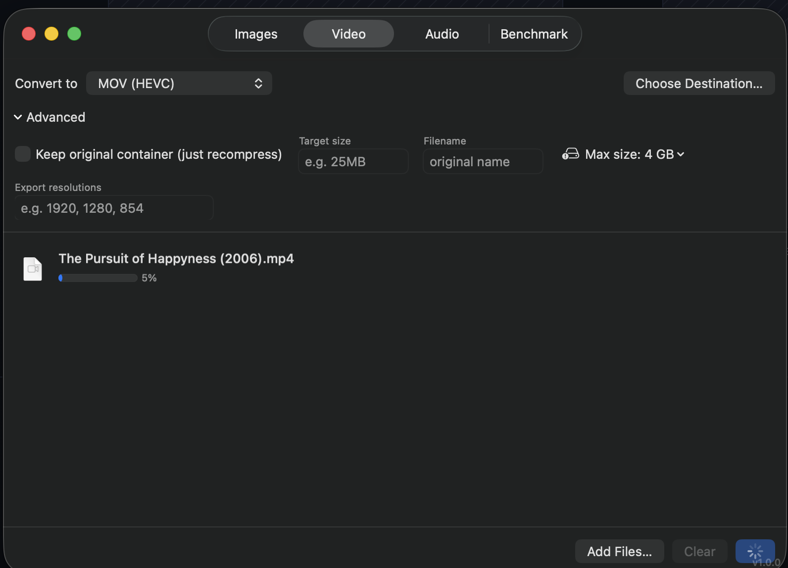
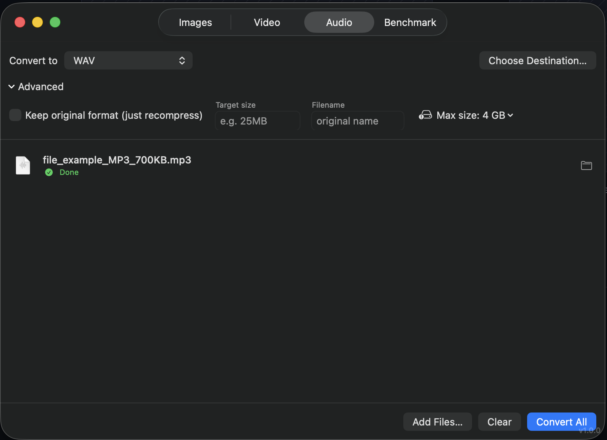
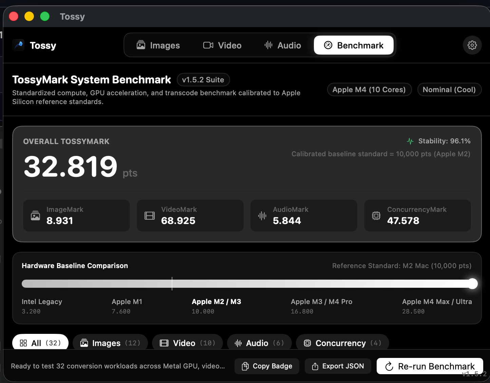

# Tossy

[](https://github.com/thatonemacosdev/tossy-macos/releases/tag/v1.5.3)
[](LICENSE)
[](https://github.com/thatonemacosdev/tossy-macos/releases)

> Toss your files in. Toss them out in whatever format you need.

A free, native macOS utility for converting images, video, and audio without Terminal, without uploading files anywhere, and without installing Homebrew or ffmpeg yourself. Toss files in, pick a format, convert. Handles everyday formats like HEIC, MP4, and MP3 as well as RAW camera files, MKV, WebM, FLAC, animated GIFs, animated WebP, and dozens more.

Website: [thatonemacosdev.github.io/tossy-macos](https://thatonemacosdev.github.io/tossy-macos/)  
Download: [v1.5.3 release](https://github.com/thatonemacosdev/tossy-macos/releases/tag/v1.5.3)

Under the hood: GPU-accelerated image processing (Metal via Core Image) and hardware video encoding (VideoToolbox via AVFoundation) where the platform supports it, falling back to a bundled `ffmpeg` for everything else.

## Screenshots

<table>
  <tr>
    <td width="50%"><br /><sub>Images: toss in, target-size compression</sub></td>
    <td width="50%"><br /><sub>Video: hardware and ffmpeg-backed formats side by side</sub></td>
  </tr>
  <tr>
    <td width="50%"><br /><sub>Audio: bitrate and format picker</sub></td>
    <td width="50%"><br /><sub>Benchmark: TossyMark score and hardware baseline scale</sub></td>
  </tr>
</table>

## Features

- **Images**: PNG, JPEG, HEIC, TIFF, BMP, GIF, JPEG 2000, AVIF, ICO, TGA, WebP, PSD, ICNS, DDS, OpenEXR, Radiance HDR, PNM, QOI, JPEG XL, and camera RAW (CR2, CR3, NEF, ARW, DNG, and most others Apple's built-in RAW pipeline supports). Also rasterizes SVG and PDF (one image per page with full rotation and crop box handling).
- **Video**: MP4/MOV (H.264, HEVC, ProRes 422) via hardware encode, plus MKV, WebM, AVI, FLV, MPEG, TS/MTS/M2TS, 3GP, ASF/WMV, MXF, VOB, DV, NUT, AV1, DNxHD, DNxHR, Animated GIF, and Animated WebP via ffmpeg.
- **Audio**: MP3, AAC, M4A, WAV, FLAC, ALAC, AIFF, OGG, Opus, WMA, AC3, E-AC3, CAF.
- **TossyMark System Benchmark (v1.5.3)**: High-precision 32-workload benchmarking engine measuring GPU rasterization, lossless compression, hardware vs software video encoding, broadcast audio DSP, and multi-core scaling with noise-resistant median timing and hardware baseline comparisons.
- **Dedicated macOS Settings Window (Cmd+,)**: Configure global output directory policies, file conflict handling, concurrency throttling (1-8 tasks), completion notification toggles, sound chimes, auto-reveal in Finder, and delete source after conversion.
- **Inline Format Inspector (CLI Knobs)**: Fine-tune WebP methods/presets/Sharp YUV, JPEG XL effort/distance, JPEG progressive/subsampling, PNG compression, TIFF algorithms, GIF dithering, Video CRF/presets/pixel formats/audio tracks/deinterlacing, and Audio CBR/VBR/sample rates/EBU R128 normalization.
- **Per-Job Overrides**: Customize format and compression settings for individual files in the batch queue.
- **Drag-Away Output Chips**: Drag converted files directly out of Tossy into Finder, Desktop, or other apps.
- **Compression to a target size**: Set a size like `25MB` and the app searches for a quality/bitrate/resolution that fits, instead of just applying a fixed setting.
- **Presets**: Save and apply custom settings across tabs.
- **Metadata control**: Option to preserve original EXIF/GPS/TIFF metadata on images, or strip container metadata on audio/video.
- **Resize**: Set an output width; aspect ratio is preserved.

## Building

Requires Xcode (for a full build) or the Swift toolchain from Command Line Tools (for `swift build` / `swift run` during development). No external dependencies to install, since the `ffmpeg`, `cwebp`/`dwebp`, and `cjxl`/`djxl` binaries this app needs are vendored under `Vendor/` and get bundled into the app automatically.

```
./build_app.sh
open ./Tossy.app
```

`swift build` / `swift run` also work directly for iterating on the app without packaging it.

## Why vendored binaries instead of just Core Image / AVFoundation everywhere?

Apple's frameworks cover a lot: RAW decoding, HEIC/AVIF, hardware H.264/HEVC/ProRes. But they do not touch MKV, WebM, most legacy codecs, or most audio formats. For those, this app shells out to a bundled, self-contained copy of `ffmpeg` (and the WebP and JPEG XL reference tools, since this particular ffmpeg build was not compiled with encoders for those). Everything under `Vendor/` was relinked with `dylibbundler` so it runs standalone, with no Homebrew or system `ffmpeg` install required on the machine running the app.

## What's New in v1.5.3

- **TossyMark Benchmark Recalibration**: Recalibrated baseline standard throughput across all 32 workloads for modern Apple Silicon chips. Corrected over-indexing on Apple M4 architecture so M2 anchors accurately at 10,000 points, M4 Air / base models score ~15,800 points, M4 Pro scores ~23,500 points, and M4 Max/Ultra scores up to 36,000+ points on the hardware comparison scale.
- **Expanded Comparison Scale**: Increased hardware comparison scale upper boundary to 40,000 points with updated Apple Silicon tier brackets.

## What's New in v1.5.2

- **Screenshot & In-Memory Drop Ingestion**: Fixed an issue where macOS floating screenshot preview thumbnails (bottom-right screen capture thumbnails), browser image drags, and unsaved clipboard payloads could not be dragged into Tossy. Expanded drop ingestion to handle raw image/audio/video data and NSImage objects seamlessly.

## What's New in v1.5.1

- **Concurrency & Drag-and-Drop Hardening**: Fixed a race condition during concurrent drag-and-drop batch queue insertion; improved URL payload resolution for files dropped directly from Finder.
- **Overwrite Safety & Collision Resolution**: Fixed a case-sensitivity issue on APFS filesystems where converting files like `photo.JPG` -> `photo.jpg` in overwrite mode could cause premature source file deletion; synchronized claimed paths across concurrent tasks.
- **ImageIO Format Knob Propagation**: Connected progressive scan and chroma subsampling settings for JPEG, Adam7 interlacing for PNG, and custom compression schemes (LZW, Deflate, PackBits) for TIFF directly into `CGImageDestination`.
- **Audio Bitrate Slider Calibration**: Fixed CBR bitrate mapping so adjusting the quality slider in the Audio tab dynamically sets the output encoding bitrate.
- **Settings State Persistence**: Fixed an issue where selecting "No limit" for maximum file size could reset back to the default 4 GB upon application relaunch.
- **Vector & PDF Transformation**: Added affine drawing transform support to `renderPDF` ensuring rotated, cropped, or non-origin PDF pages are rendered with correct orientation and bounds.
- **Filter Chain Stacking**: Resolved duplicate scale filter stacking when exporting animated GIFs with custom width constraints.
- **UX & Audio Polish**: Eliminated duplicate simultaneous audio chimes when batch completion alerts are triggered; refined benchmark report export toasts.

## License

The app's own code (everything outside `Vendor/`) is licensed under GPL-3.0; see `LICENSE`.

The vendored `ffmpeg` binary in `Vendor/ffmpeg/` is itself GPL-licensed (it is built with `--enable-gpl` for libx264/libx265). See `Vendor/ffmpeg/LICENSE_NOTICE.md` for details. The WebP tools (`Vendor/webp/`) and JPEG XL tools (`Vendor/jxl/`) are both BSD-licensed.
