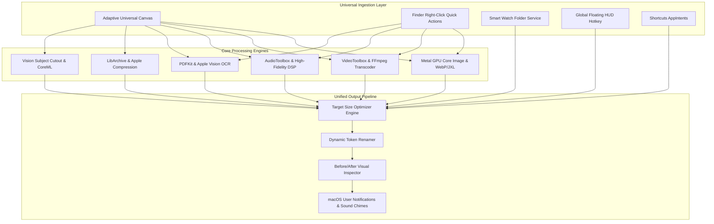

# Tossy v2.0.0 Grand Vision & Feature Roadmap
**Positioning Statement:** *"The only native macOS file utility you will ever need."*

---

## 1. Executive Summary & Core Philosophy

Tossy v1.0 through v1.7 established an ultra-fast, local-first media conversion engine powered by Apple Metal GPU processing, hardware VideoToolbox acceleration, and bundled standalone tools.

**Tossy v2.0.0** elevates Tossy from a media conversion app into the definitive, universal macOS file workspace. It eliminates the need for dozens of disparate single-purpose utilities (ImageOptim, HandBrake, Permute, Keka, PDFgear, exiftool GUIs, and cloud upload converters) with a single, privacy-focused, zero-subscription native application.

### Key Pillars of Tossy 2.0
1. **Unified File Intelligence**: Automatically recognizes and transforms any file type (Media, Documents, PDFs, Archives, Vector, and RAW).
2. **Zero-Friction Ingestion**: Convert via Universal Canvas, Floating Global HUD, Smart Watch Folders, Menu Bar Dropzone, or Finder Context Menu.
3. **Studio Manipulation Toolkit**: Lossless video trimming, audio track extraction, bulk watermarking, privacy EXIF stripping, PDF merging/splitting, and on-device AI subject cutout.
4. **100% On-Device Privacy & Speed**: Zero cloud processing, zero analytics telemetry, zero subscriptions, fully hardware-accelerated for Apple Silicon and modern Intel Macs.

---

## 2. Comprehensive Feature Matrix for v2.0.0

### Pillar 1: PDF & Document Studio (New Domain)
Move beyond media to become a full-featured PDF and document processor:

- **PDF Merge & Rearrange**: Drag multiple PDFs, reorder pages with visual thumbnails, and merge into a single optimized document in milliseconds.
- **PDF Splitter & Page Extractor**: Split by page ranges, extract specific pages, or burst a 100-page document into individual single-page files.
- **Target Size PDF Compression**: Compress large scans and presentations to meet strict email or portal limits (e.g. 5 MB or 10 MB) via intelligent image recompression and font subsetting.
- **On-Device Apple Vision OCR**: Extract searchable, selectable text from scanned PDFs and images directly to clipboard, plain text (`.txt`), Markdown (`.md`), or searchable PDF format using Apple Silicon Neural Engine.
- **Document to Image / Image to PDF**: Convert multi-page PDFs to high-DPI PNG/JPEG sequences with rotation and crop-box preservation; compile multi-image collections into structured PDF documents.
- **Markdown & Code Formatter Export**: Render Markdown (`.md`), HTML, and code files to high-resolution styled PDF or PNG syntax-highlighted code cards.

---

### Pillar 2: Media Studio Actions & Lossless Transformations

- **Lossless Instant Video Trimming**:
  - Keyframe-accurate video cutting without re-encoding.
  - Trim unwanted beginnings/ends of screen recordings and camera clips in under 200 milliseconds via stream copying (`-c copy`).
- **1-Click Audio Track Extraction & Muting**:
  - Extract pristine audio streams from videos directly into MP3, AAC, FLAC, or WAV.
  - Strip audio tracks completely to create silent clips for web backgrounds or presentations.
- **Video Geometry & Speed Controls**:
  - Rotate video by 90 degrees, 180 degrees, or 270 degrees, or flip horizontally/vertically without quality degradation.
  - Adjust playback speed (0.25x slow motion to 4x fast forward) with audio pitch correction.
- **On-Device Neural Background Removal**:
  - Isolate subjects and remove backgrounds from photos and graphics in one click using Apple Vision subject segmentation (`VNGenerateForegroundInstanceMaskRequest`), exporting transparent PNG or WebP files instantly.
- **Bulk Image Watermarking & Branding**:
  - Apply custom text or image logos across hundreds of photos with adjustable opacity, positioning anchors (e.g. Bottom-Right), scale constraints, and margin offsets.
- **Privacy Shield & EXIF Metadata Sanitizer**:
  - Single-click stripping of GPS coordinates, camera serial numbers, lens info, timestamps, and author metadata before sharing images online.
  - Option to view full metadata inspection breakdown (ISO, shutter speed, aperture, focal length, color space).

---

### Pillar 3: Archive & Compression Suite

- **Universal Archive Extraction**:
  - Unpack `.zip`, `.tar.gz`, `.tar.bz2`, `.tar.xz`, `.7z`, `.rar`, and `.iso` with drag-and-drop ease.
- **Secure Encrypted Archive Creation**:
  - Create encrypted `.zip` or `.7z` archives protected by military-grade AES-256 password encryption.
- **Multi-Part Volume Splitting**:
  - Split large folders or archives into customizable chunks (e.g. 100 MB, 500 MB, 2 GB) for FAT32 drives or cloud upload restrictions.

---

### Pillar 4: Automation, Smart Rules & Ecosystem Integration

- **Smart Watch Folders ("Tossy Dropboxes")**:
  - Configure automated monitor folders (e.g. `~/Downloads/Auto-WebP` or `~/Desktop/Screenshots-to-PNG`).
  - Automatically detect incoming files matching rules and execute conversions in the background without user interaction.
- **macOS Shortcuts AppIntents**:
  - Native Siri Shortcuts actions:
    - `Convert File with Tossy`
    - `Compress File to Target Size`
    - `Extract Audio from Video`
    - `Remove Background from Image`
    - `Merge PDFs with Tossy`
- **Global Floating HUD (Quick-Toss Hotkey)**:
  - Configurable global shortcut (e.g. `Option + Space` or `Cmd + Shift + T`) that pops up a floating translucent drop HUD over any full-screen app for instant conversion.
- **Raycast & Alfred Extensions**:
  - Official extension manifest enabling command palette file conversions directly from Raycast or Alfred.

---

### Pillar 5: User Interface & Experience ("Titanium 2.0")

- **Adaptive Universal Canvas**:
  - A unified drop area that automatically adapts its layout, inspector controls, and quick actions based on what was dropped (Image, Video, Audio, PDF, Archive, or Mixed Batch).
- **Batch Metadata & Token-Based Renamer**:
  - Rename converted files dynamically using powerful token patterns (`{original_name}`, `{date_iso}`, `{dimensions}`, `{resolution}`, `{format}`, `{counter_03d}`).
- **Interactive Audio Waveform & Video Scrubbing**:
  - Live audio waveform previews and multi-frame video timeline thumbnails for precise visual confirmation before conversion.
- **Integrated Quality Inspector Enhancement**:
  - Split-slider visual inspection extended to compare original PDF vs compressed PDF and original image vs neural background cutout.

---

## 3. High-Impact Marketing & Launch Blueprint

### Positioning & Taglines
- **Primary Hero**: *"Tossy 2.0 - The Only Native macOS File Utility You Will Ever Need."*
- **Sub-Hero**: *"Convert, compress, trim, merge, extract, and transform images, video, audio, PDFs, and archives. 100% on-device. Zero cloud uploads. Free and open source."*
- **Competitive Differentiator**: *"Why install 8 different paid subscription utilities when one native, blazing-fast Apple Silicon app does it all locally?"*

---

### Comparison Matrix for Launch Campaign

| Capability | Tossy 2.0 | Permute ($15) | HandBrake | ImageOptim | Keka ($5) | PDFgear | Cloud Converters |
| :--- | :--- | :--- | :--- | :--- | :--- | :--- | :--- |
| **All-in-One Media & Docs** | **Yes** | Video/Audio only | Video only | Images only | Archives only | PDF only | Mixed |
| **Target Size Fitting** | **Yes (Auto)** | No | No | No | No | No | Paywalled |
| **Hardware VideoToolbox** | **Yes** | Yes | Partial | N/A | N/A | N/A | No (Server) |
| **Metal GPU Images** | **Yes** | No | N/A | CPU only | N/A | N/A | No |
| **PDF Merge, Split & OCR** | **Yes** | No | No | No | No | Yes | Paywalled |
| **Lossless Video Trimming** | **Yes** | No | No | N/A | N/A | N/A | No |
| **On-Device Background Cut**| **Yes** | No | No | No | No | No | Cloud / Paid |
| **Archive Encrypt / Unpack** | **Yes** | No | No | No | Yes | No | No |
| **100% Local & Privacy Safe**| **Yes** | Yes | Yes | Yes | Yes | Yes | **NO (Uploaded)**|
| **Cost & Licensing** | **Free / GPL-3** | $14.99 | Free / GPL | Free / GPL | $4.99 / Store | Free / Closed | $10-30 / month |

---

### Step-by-Step Launch Execution Timeline

#### Phase 1: Pre-Launch Asset Preparation
1. **Interactive Demo Video & GIFs**:
   - 30-second crisp demo showing: Dragging a 4K drone video and fitting to 25 MB in 3 seconds; Dragging 5 PDFs and merging instantly; Right-clicking a photo in Finder to remove background.
2. **Product Hunt & Show HN Collateral**:
   - Hero banner graphics (clean macOS dark mode aesthetic).
   - Maker comment explaining the open-source philosophy, technical architecture (Swift + Metal + VideoToolbox + AVFoundation + CoreML + vendored ffmpeg), and zero-telemetry privacy guarantee.
3. **Press Kit & Showcase Website Update**:
   - Modernized landing page with interactive canvas preview and side-by-side comparison slider.

#### Phase 2: Launch Day Blast ("Go Hot")
1. **Product Hunt Launch**: Target #1 Product of the Day.
2. **Hacker News (Show HN)**: Focus on the technical implementation: *"Show HN: Tossy 2.0 - A free, native macOS utility written in Swift and Metal that replaces all cloud file converters"*.
3. **Reddit Tech Communities**:
   - `r/macapps`: Feature-rich launch announcement highlighting native Apple Silicon optimization and free GPL license.
   - `r/apple` & `r/mac`: Highlighting privacy benefits over web converters and built-in TossyMark benchmarks.
   - `r/workflow` & `r/productivity`: Showcasing Finder Quick Actions and Shortcuts AppIntents.
4. **X / Tech Influencer Outreach**:
   - Short, punchy video demos demonstrating instant conversions and before/after quality comparisons.

---

## 4. Technical Architecture Roadmap for Implementation

---

## 5. Milestone Breakdown for v2.0.0

- **v2.0.0-alpha.1**: PDF Studio Integration (Merge, Split, Target Size Compress, Vision OCR).
- **v2.0.0-alpha.2**: Studio Media Tools (Lossless Trimming, Audio Extraction, Video Rotate/Speed, EXIF Sanitizer).
- **v2.0.0-beta.1**: Smart Watch Folders, Global Floating HUD, and Shortcuts AppIntents.
- **v2.0.0-rc.1**: Universal Adaptive Canvas UI, Token Renamer, and Performance Calibration.
- **v2.0.0-final**: Full Marketing Launch on Product Hunt, Hacker News, Reddit, and GitHub Releases.
